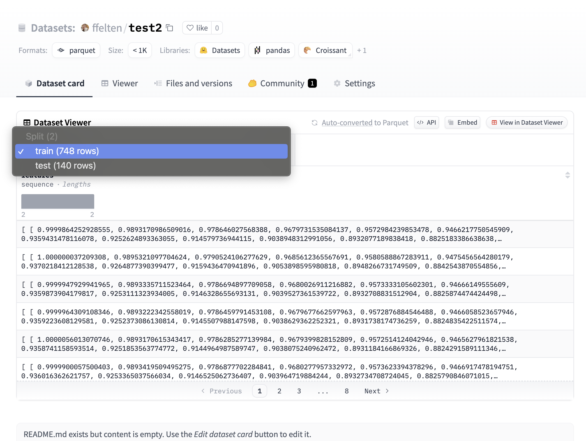

Here is the script I've used to upload the data to HF:

```python
import numpy as np
from datasets import Dataset, DatasetDict


train_split = np.load('train.npy')
test_split = np.load('test.npy') # https://github.com/IDEALLab/OptimizingDiffusionSciTech2024/blob/main/data/optimized_data/test/opt_airfoils.npy
datasets = []
for split in [train_split, test_split]:
    data_dict = {"features": split.tolist()}  # Convert numpy array to list
    dataset = Dataset.from_dict(data_dict)
    datasets.append(dataset)

dataset_dict = DatasetDict({"train": datasets[0], "test": datasets[1]})
dataset_dict.push_to_hub("ffelten/test2")
```

Here is what it looks like on HF:


Now to pull the data
```python
import numpy as np
from datasets import load_dataset

dataset = load_dataset("ffelten/test2", split="train")
# This gives a shape (2, 192)
np.array(dataset["features"][0]).shape
```
