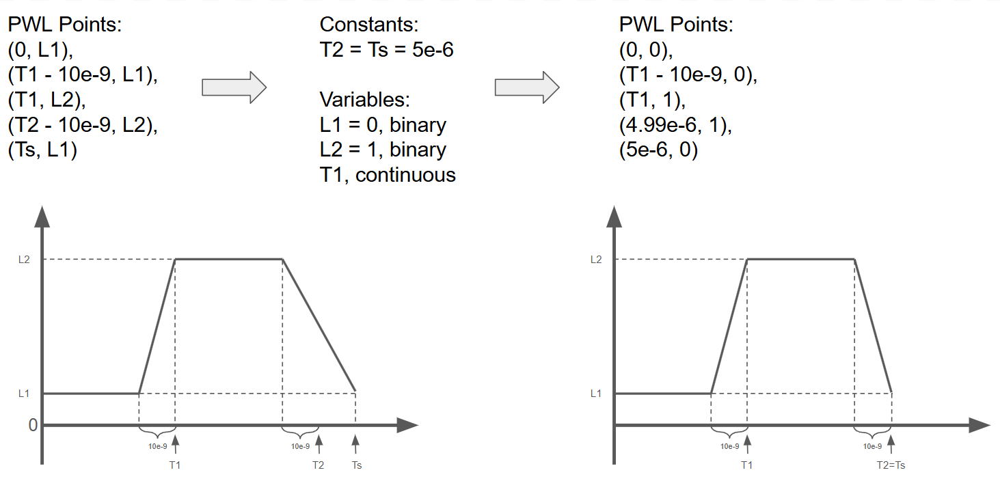

# Title

## Environment
`pip install -e ".[electronics]"`

## Installation of ngSpice
### 1. Windows
Download ngSpice from https://sourceforge.net/projects/ngspice/files/ng-spice-rework/44.2/.

Make sure `ngspice.exe` is located either at `C:/Program Files/Spice64/bin/ngspice.exe` or at `C:/Program Files (x86)/ngspice/bin/ngspice.exe`.

### 2. Ubuntu
``` bash
sudo apt update
sudo apt install ngspice
```

Available in Ubuntu 20, 22 and 24.

Note: ``pip install`` won't work.

### 3. MacOS
`brew install ngspice`

## Example circuit graph


Using `problem.render()` will create this graph:


## Design Variables
This is a more detailed version compared to that in `v0.py`.

### Problem Description
This problem simulates a power converter circuit which has a fixed circuit topology. There are 5 switches, 4 diodes, 3 inductors and 6 capacitors.
The circuit topology is fixed. It is defined in the netlist file `5_4_3_6_10-dcdc_converter_1.net`.
By changing circuit parameters such as capacitance, we rewrite the netlist file and use ngSpice to simulate the circuits to get the performance metrics, which are defined as the objectives of this problem.
You can use this problem to train your regression model. You can also try to find the optimal circuit parameters that minimize objectives.

### Design space
Let's start with the waveform of the driving voltage source (such as `V_GS3`) for a voltage-controlled switch (such as `S3`) in ngSpice.


This has the same effect with LTSpice Pulse Voltage Source.

Credit to [[Youtube] LTSpice Pulse Voltage Parameters](https://www.youtube.com/watch?v=5sYnePkanfU).

- `GS#_Ts`: The time of a specific point in a PWL voltage source. In our case, it is equivalent to `Tperiod` (LTSpice syntax).
  It is set to the **constant** `GS#_Ts` = 5e-6. So we do not count it as a design variable.
- `GS#_T2`: The time of a specific point in a PWL voltage source. In our case, `GS#_T2` = `GS#_T1` = 5e-6. So we do not count it as a design variable.

Now, the design space is represented by a 20-dimensional vector that defines the cicuit parameters.
- `C0`, `C1`, `C2`, `C3`, `C4`, `C5`: Capacitor values in Farads for each capacitor. Range: [1e-6, 2e-5].
- `L0`, `L1`, `L2`: Inductor values in Henries for each inductance. Range: [1e-6, 1e-3].
- `T1`: Duty cycle, the fraction of "on" time. Range: [0.1, 0.9]. Because all the 5 switches change their on/off state at the same time, we only need to set one `T1` value.
    For example, `T1 = 0.1` means that all the switches are first turned "on" for 10% of the time, then "off" for the remaining 90%. This on-off pattern repeats at a high frequency until the simulation is over.
    It equals (`Tdelay` + `Trise`) (LTSpice syntax).
- `GS0_L1`, `GS1_L1`, `GS2_L1`, `GS3_L1`, `GS4_L1`: Switches `L1`. Binary values (0 or 1).
- `GS0_L2`, `GS1_L2`, `GS2_L2`, `GS3_L2`, `GS4_L2`: Switches `L2`. Binary values (0 or 1).
    Each switch is a voltage-controlled switch. For example, `S0` is controlled by `V_GS0`, whose voltage is defined by `GS0_L1` and `GS0_L2`.
    In short, 0 means `S0` is off and 1 means `S0` is on.
    For example, When `GS0_L1 = 0` and `GS0_L2 = 1`, `S0` is first turned off for time `T1 * Ts`, and then turned on for (approximately) `(1 - T1) * Ts`, where `Ts` is set to 5e-6.
    As a result, each switch can be on -> off, on -> on, off -> on, or off -> off independently.

### Objectives
The objectives are defined by the following parameters:
- `DcGain-0.25`: The ratio of load vs. input voltage. It's desired to be as close to a preset constant, such as 0.25, as possible.
- `Voltage Ripple`: Fluctuation of voltage on the load `R0`. The lower the better.

### Conditions
There is no condition for this problem.

### Simulator
The simulator is ngSpice circuit simulator. You can download it based on your operating system:
- Windows: https://sourceforge.net/projects/ngspice/files/ng-spice-rework/44.2/
- MacOS: `brew install ngspice`
- Linux: `sudo apt-get install ngspice`

### Dataset
The dataset linked to this problem is hosted on the [Hugging Face Datasets Hub](https://huggingface.co/datasets/IDEALLab/power_electronics).

### v0

#### Fields
The dataset contains 3 fields:
- `initial_design`: The 20-dimensional design variable defined above.
- `DcGain`: The ratio of load vs. input voltage.
- `Voltage_Ripple`: The fluctuation of voltage on the load `R0`.

#### Creation Method
We created this dataset in 3 parts. All the 3 parts are simulated with {`GS0_L1`, `GS1_L1`, `GS2_L1`, `GS3_L1`, `GS4_L1`} = {1, 0, 0, 1, 1} and {`GS0_L2`, `GS1_L2`, `GS2_L2`, `GS3_L2`, `GS4_L2`} = {1, 0, 1, 1, 0}.
Here are the 3 parts:
1. 6 capacitors and 3 inductors only take their min and max values. `T1` ranges {0.1, 0.2, 0.3, 0.4, 0.5, 0.6, 0.7, 0.8, 0.9}. There are 2^6 * 2^3 * 9 = 4608 samples.
2. Random sample 4608 points in the 6 + 3 + 1 = 10 dimensional space. Min and max values in each dimension will not be sampled.
3. Latin hypercube sample 4608 points in the 6 + 3 + 1 = 10 dimensional space. Each dimension is split into 10 intervals. Min and max values in each dimension will not be sampled.

## References
If you use this problem in your research, please cite the following paper:


## Hugging Face Dataset
Here are the scripts that I used to load from/upload to Hugging Face.

### 1. Load from HF
``` python
from datasets import load_dataset
# HF_dataset = load_dataset("IDEALLab/power_electronics_v0")
# train_dataset = HF_dataset["train"]
train_dataset = load_dataset("IDEALLab/power_electronics_v0", split="train")
print(len(train_dataset), train_dataset[0], train_dataset["initial_design"])
```

### 2. Select and modify loaded dataset
``` python
shuffled_train_dataset = train_dataset.shuffle(seed=523)
train_dataset.select(range(4))
```

For more information, please refer to [datasets/process](https://huggingface.co/docs/datasets/en/process), including [Dataset.select](https://huggingface.co/docs/datasets/v3.5.0/en/package_reference/main_classes#datasets.Dataset.select), [Dataset.shuffle](https://huggingface.co/docs/datasets/v3.5.0/en/package_reference/main_classes#datasets.Dataset.shuffle) and so on.

### 3. Upload to HF
``` python
from datasets import DatasetDict
dataset_dict = DatasetDict({"train": train_dataset, "val": val_dataset, "test": test_dataset})
dataset_dict.push_to_hub("IDEALLab/power_electronics_v0")
```
